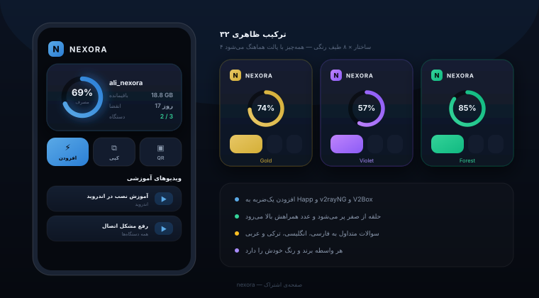
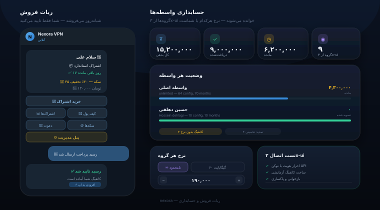

<div align="center">

<br>


**صفحه‌ی اشتراکی که مشتری دوستش دارد**

**رباتی که شب‌ها به‌جای شما می‌فروشد**

**حسابداری واسطه‌ها، بدون دردسر**

<br>


<br>
<br>

<a href="https://t.me/yanexoravpn"></a>
<a href="https://t.me/crm_nexoravpn"></a>

<br>
<br>

[فارسی](#-فارسی) &nbsp;•&nbsp; [English](#-english) &nbsp;•&nbsp; [نصب](#-نصب)

<br>

</div>

---

<div align="center">

## 🇮🇷 فارسی

<br>

</div>

ساعت سه بامداد است. مشتری پول واریز کرده و منتظر کانفیگ است.

بیدار شوید و دستی بسازید — مشتری راضی، شما خسته. نشوید — صبح یک پیام عصبانی دارید.

**نکسورا برای همین شب‌ها ساخته شد.**

<br>

<div align="center">

### سه فضای کاری

</div>

| | |
|:--|:--|
| 🎨 **صفحه اشتراک** | ۳۲ ترکیب ظاهری، افزودن یک‌ضربه، چهار زبان |
| 🤖 **ربات تلگرام** | فروش خودکار، رسید و تایید، سکه و دعوت |
| 💰 **حسابداری** | نرخ هر واسطه، صورتحساب، پرداخت‌ها |


---

<div align="center">

## 🎨 صفحه اشتراک

<br>



<br>

</div>

**چهار ساختار در هشت طیف رنگی** — و پالت سفارشی هرچقدر بخواهید.

<div align="center">

`Classic` &nbsp; `Analytics` &nbsp; `Wallet` &nbsp; `Console`

</div>

<br>

| | |
|:--|:--|
| ⚡ **افزودن یک‌ضربه** | لینک مستقیم به اپلیکیشن، کد QR، کپی لینک |
| 📊 **درجه‌سنج مصرف** | حلقه از صفر پر می‌شود، هشدار اتمام حجم، شمارش انقضا |
| 🌍 **چهار زبان** | سوالات متداول به فارسی، انگلیسی، ترکی و عربی |
| 🎬 **ویدیو آموزشی** | از کانال تلگرام خودتان، بدون مصرف فضای سرور |
| 👥 **واسطه‌ها** | هر واسطه برند و رنگ خودش را دارد |

<br>

> [!NOTE]
> **رنگ‌ها کاملاً هماهنگ‌اند.** وقتی پالت طلایی انتخاب می‌کنید، حلقه‌ی مصرف
> و دکمه‌ها هم طلایی می‌شوند. رنگ متن روی دکمه‌ها هم از روی کنتراست واقعی
> محاسبه می‌شود تا روی هر پالتی خوانا بماند.


---

<div align="center">

## 🤖 ربات فروش و 💰 حسابداری

<br>



<br>

</div>

### جریان فروش

```
مشتری پلن را می‌بیند  ──►  کارت‌به‌کارت  ──►  رسید می‌فرستد
                                                    │
      شما یک ضربه می‌زنید  ◄──  اعلان تلگرام  ◄──────┘
              │
              ▼
      کانفیگ خودکار ساخته و تحویل می‌شود
```

<br>

| | |
|:--|:--|
| 💳 **پرداخت** | کارت‌به‌کارت با رسید عکسی یا متنی — بدون درگاه |
| ❌ **رد با دلیل** | مشتری می‌فهمد چرا، و سکه‌هایش خودکار برمی‌گردد |
| 💎 **سکه و دعوت** | نردبان تخفیف — هرچه بیشتر نگه دارد، تخفیف بزرگ‌تر |
| 👛 **کیف پول** | شارژ یک‌بار، تمدید یک‌ضربه، تمدید خودکار |
| 🎁 **تست رایگان** | یک‌بار برای هر کاربر، حجم و مدتش با شماست |
| ⚙️ **پنل داخل ربات** | رسیدها، کاربران، آمار، پیام همگانی |

<br>

**گروه مدیریت تلگرام** — ربات یک سوپرگروه می‌سازد و تاپیک‌ها را خودش اضافه می‌کند:

<div align="center">

`💳 رسیدها` &nbsp; `👥 کاربران` &nbsp; `📊 آمار` &nbsp; `💾 بکاپ` &nbsp; `🎫 تیکت` &nbsp; `⚠️ هشدار`

</div>

<br>

### حسابداری واسطه‌ها

گروه‌ها **مستقیم از دیتابیس ۳x-ui** خوانده می‌شوند — همان‌هایی که در پنل ساخته‌اید.

| | |
|:--|:--|
| 🎚 **انتخابی** | مشخص کنید کدام گروه واسطه است و کدام مشتری مستقیم |
| 💵 **نرخ آزاد** | برای هر گروه جداگانه، هر حجمی که بخواهید یا نامحدود |
| 📄 **صورتحساب** | ریز کانفیگ‌ها با ماه، تمدید و مبلغ |
| 💰 **پرداخت‌ها** | ثبت دریافتی‌ها تا مانده درست بماند |
| 💾 **بک‌آپ** | نرخ‌ها، پرداخت‌ها و لاگ تمدید |

<br>

> [!NOTE]
> **درباره‌ی تمدید:** پنل ۳x-ui تاریخچه‌ی تمدید ندارد، پس ماه‌های گذشته از
> فاصله‌ی «تاریخ ایجاد تا انقضا» تخمین زده می‌شوند و هر ردیف صادقانه برچسب
> «قطعی» یا «تخمینی» می‌گیرد. از لحظه‌ی نصب، هر تمدیدی که از نکسورا انجام
> شود ثبت می‌شود و تخمین جای خودش را به عدد قطعی می‌دهد.

<br>

---

<div align="center">

## 📦 نصب

</div>

**پیش‌نیاز**

| | |
|:--|:--|
| سیستم‌عامل | اوبونتو ۲۰.۰۴ به بالا یا دبیان ۱۱ به بالا |
| پنل | ۳x-ui نصب‌شده و در حال کار |
| دامنه | یک دامنه که به سرور اشاره کند |
| حافظه | ۱ گیگابایت رم |

<br>

```bash
git clone https://github.com/nexoratech-v/nexora-subscription-manager.git
cd nexora-subscription-manager
sudo bash install.sh
```

نصب‌کننده دامنه را می‌پرسد و بقیه را خودش انجام می‌دهد:

- گواهی `SSL` و پیکربندی `nginx`
- سرویس `systemd` و ساخت پنل
- اگر حافظه کم باشد، فایل `swap` هم می‌سازد

<br>

### راه‌اندازی ربات

| | |
|:--:|:--|
| **۱** | توکن ربات را از [@BotFather](https://t.me/BotFather) بگیرید |
| **۲** | در پنل بروید به بخش ربات، سپس اتصال و تنظیمات |
| **۳** | توکن ربات و آدرس پنل ۳x-ui را وارد کنید |
| **۴** | توکن `API Token` را از پنل بگیرید — مسیرش پایین آمده |
| **۵** | دکمه‌ی **اجرای تست** را بزنید |
| **۶** | یک پلن و یک شماره کارت اضافه کنید |
| **۷** | ربات را از پنل روشن کنید |

<br>

**مسیر توکن در پنل**

```
Settings → Security → API Token
```

توکن از رمز عبور امن‌تر است، چون هر لحظه می‌توانید باطلش کنید بدون اینکه
چیز دیگری تغییر کند.

<br>

> [!IMPORTANT]
> توکن ربات نکسورا باید با توکن ربات داخلی ۳x-ui **متفاوت** باشد.
> تلگرام اجازه نمی‌دهد دو ربات روی یک توکن کار کنند.

<br>

### تست اتصال

عبارت «وصل شد» یعنی رمزتان درست است — نه اینکه ربات می‌تواند کانفیگ بسازد.
خیلی وقت‌ها کاربر پنل فقط دسترسی خواندن دارد، و این وقتی معلوم می‌شود که
اولین مشتری پول داده و کانفیگ نگرفته است.

نکسورا واقعاً یک کانفیگ آزمایشی می‌سازد، بازخوانی می‌کند و پاکش می‌کند:

```
✓  احراز هویت                 موفق
✓  خواندن اینباندها             سه عدد
✓  تشخیص نسخه پنل             معماری جدید
✓  ساخت کانفیگ آزمایشی         ساخته شد
✓  بازخوانی                   پیدا شد
✓  پاکسازی                    حذف شد
```

اگر همه سبز شد، مطمئن هستید که فروش کار می‌کند.

<br>

---

<div align="center">

## ⚙️ دستورات

</div>

| دستور | کاری که می‌کند |
|:--|:--|
| `nexora` | وضعیت کلی |
| `nexora bot` | کنترل ربات |
| `nexora doctor` | بررسی و رفع خودکار مشکلات |
| `nexora update` | به‌روزرسانی از گیت‌هاب |
| `nexora rollback` | بازگشت به نسخه‌ی قبلی |
| `nexora backup` | پشتیبان‌گیری |
| `nexora logs` | لاگ زنده |

<br>

قبل از هر به‌روزرسانی یک نسخه‌ی ذخیره‌شده گرفته می‌شود، پس دستور
`nexora rollback` همیشه شما را برمی‌گرداند.

<br>

**نام سرویس‌ها در systemd**

```bash
systemctl status nexora-panel
systemctl status nexora-bot
```

<br>

---

<div align="center">

## 🔧 زیر کاپوت

</div>

| بخش | فناوری |
|:--|:--|
| بک‌اند | `FastAPI` · ۴۹ endpoint · `SQLite` |
| فرانت‌اند | `React` · `Vite` · `Tailwind` |
| صفحه‌ی اشتراک | `Go template` — همان چیزی که پنل انتظار دارد |
| ربات | پایتون خالص · تنها وابستگی: `requests` |

<br>

> [!NOTE]
> **ربات و حسابداری ماژول جدا هستند.** هرکدام سرویس و دیتابیس مستقل خودشان
> را دارند، و خواندن از ۳x-ui **فقط‌خواندنی** است. اگر ربات از کار بیفتد،
> پنل و صفحه‌ی مشتریان دست‌نخورده کار می‌کنند.

<br>

### تست

```bash
cd bot
python3 test_bot.py      # ۷۱ تست واحد
python3 test_flow.py     # ۳۸ تست جریان خرید
python3 test_admin.py    # ۳۴ تست پنل مدیریت
```

مجموعاً **۲۶۷ تست** — شامل سرور واقعی با درخواست HTTP، تلاش تزریق SQL،
داده‌ی خراب، و اجرای هر چهار قالب در مرورگر شبیه‌سازی‌شده.

<br>

---

<div align="center">

## 🌍 English

<br>

</div>

It's 3 AM. A customer just paid and is waiting for their config.

Get up and build it by hand — they're happy, you're exhausted. Stay asleep —
you wake to an angry message.

**Nexora was built for those nights.**

<br>

| | |
|:--|:--|
| 🎨 **Subscription page** | 32 looks, one-tap install, four languages |
| 🤖 **Telegram bot** | Sells by itself, receipts, coins and referrals |
| 💰 **Accounting** | Per-reseller rates, invoices, payments |

<br>

**Subscription page** — four structures across eight palettes. Direct install
into Happ, v2rayNG and V2Box. A usage ring that sweeps from zero while the figure
counts up. FAQ in Persian, English, Turkish and Arabic. Every reseller gets their
own brand, and their customers never see yours.

**Sales bot** — card-transfer payment with photo or text receipts. One tap
approves, and the config is created in 3x-ui and delivered automatically.
Rejection comes with a reason and refunds any coins spent. Wallet, free trial,
expiry reminders, and an admin panel inside the bot itself.

**Accounting** — groups are read straight from the 3x-ui database. Mark which
ones are resellers, set a rate table for each, and invoices build themselves.
Payments are logged in Nexora, since 3x-ui doesn't record them.

<br>

```bash
git clone https://github.com/nexoratech-v/nexora-subscription-manager.git
cd nexora-subscription-manager
sudo bash install.sh
```

<br>

> [!IMPORTANT]
> The bot token must differ from 3x-ui's own bot token.
> Telegram does not allow two bots on one token.

<br>

**MIT** — use it, change it, sell it.

<br>

---

<div align="center">

<br>

**ساخته شده برای کسانی که ترجیح می‌دهند ساعت سه بامداد بخوابند**

<sub>Built for people who would rather be asleep at 3 AM</sub>

<br>

<a href="https://t.me/yanexoravpn"></a>

<br>


</div>
